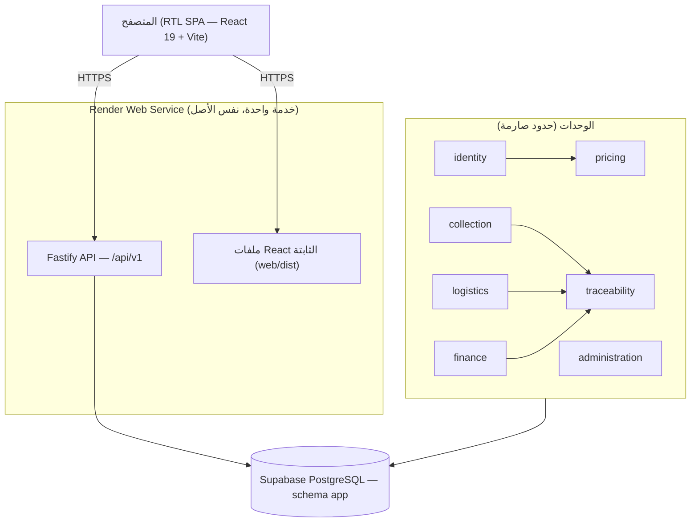

# المعمارية (ARCHITECTURE)

## نظرة عامة

**Modular Monolith** بطبقات نظيفة (Clean/Hexagonal): خدمة واحدة قابلة للنشر بسهولة على Render، بحدود داخلية صارمة تسمح بفصل أي وحدة لاحقاً.



## الطبقات داخل كل وحدة

```
modules/<name>/
├─ api/              ← HTTP فقط: مسارات Fastify + مخططات TypeBox + حراس صلاحيات
├─ application/      ← حالات الاستخدام (ملف لكل حالة) + استعلامات القراءة (Dashboards)
├─ domain/           ← الكيانات + المحركات النقية + السياسات (بلا أي إطار)
└─ infrastructure/   ← مستودعات Drizzle + منافذ خارجية
```

**اتجاه الاعتماد:** `api → application → domain` و`infrastructure → domain` فقط.

**الفرض (dependency-cruiser في CI — صفر انتهاكات):**
- `domain/` لا يستورد Fastify/Drizzle/pg ولا أي طبقة أخرى (محركات نقية).
- `api/` لا يستورد بنية تحتية لوحدة أخرى (التواصل عبر application/public).
- الوقت عبر `Clock` والعشوائية عبر `RandomSource` (محقونتان — قابليتان للاختبار).

## الوحدات

| الوحدة | المسؤولية | المحرك النقي |
|---|---|---|
| `identity` | الدخول، JWT/refresh rotation، الدعوات، الحسابات، التدقيق | permissions.ts, password.ts, identity-hash.ts |
| `catalog` | أنواع النفايات، الإضافات، مناطق الخدمة | — |
| `pricing` | تقدير السلة (عام) | **pricing.ts** |
| `collection` | طلبات الجمع + الانتقالات + الظهور | **lifecycle.ts** |
| `traceability` | سلسلة الهاش + التتبع العام + AnchorPort | **chain.ts** |
| `logistics` | الصفقات، الأكياس، الأوزان | — |
| `finance` | الفواتير، التوزيع، الدفتر، المستحقات | **distribution.ts** |
| `administration` | الإعدادات المُصدَرة | — |
| `dashboards` | نقاط نهاية لوحات الأدوار الستة (استعلامات قراءة فقط) | — |

## القرارات (ملخص — التفاصيل في docs/adr/)

- **العقد الملتزم:** `openapi.json` في جذر المستودع (45 مساراً)؛ عميل الواجهة مولّد منه (`openapi-typescript` + `openapi-fetch`) — [ADR-001].
- **المال:** `Money` (decimal.js) نص في JSON + `NUMERIC(14,2)`؛ كل التوزيع بوحدات صغرى صحيحة (أغورة) بطريقة الباقي الأكبر — [ADR-002].
- **التتبع:** سلسلة لكل كيان (طلب/صفقة/كيس) بتسلسل `seq` وقيد UNIQUE + قفل صف؛ JSON قانوني (مفاتيح مرتبة) يجعل التحقق مستقراً عبر round-trip من jsonb — [ADR-003].
- **الجلسات:** Access JWT قصير في ذاكرة الصفحة فقط + Refresh عشوائي هاشد في كوكي HttpOnly مع تدوير وكشف إعادة استخدام — [ADR-004].
- **Node 24 LTS** مثبت في `engines` وCI وDocker وrender.yaml — [ADR-005].

## أرقام التحقق

- 24 جدولاً في schema `app`، 4 SEQUENCE، فهرس فريد جزئي (فاتورة فعّالة واحدة للصفقة)، محرّمات append-only (tracking_events, ledger_entries)، RLS deny-all على كل الجداول.
- 45 مسار API، 17 صلاحية، 6 أدوار.
- الرحلة الكاملة E2E (77 فحصاً) تعمل على PostgreSQL حقيقي: من طلب المواطن حتى التوزيع المالي والتحقق من السلسلة.
